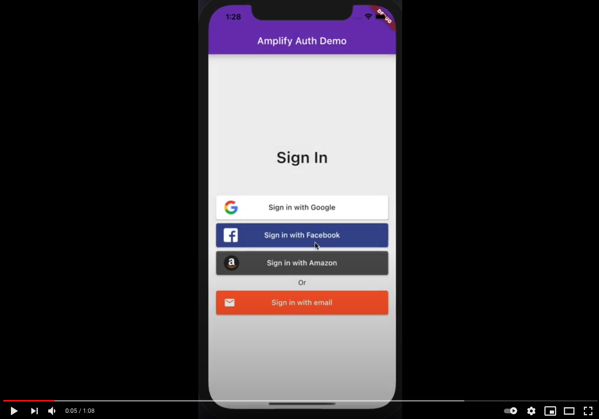

# Reference Authentication Flow with Flutter & AWS Amplify

YouTube video demo here: 

This project shows how to implement a full authentication flow in Flutter, using various AWS Amplify sign-in methods.

## Project goals

This project shows how to:

- use the various AWS Amplify sign-in methods
- build a robust authentication flow
- use appropriate state management techniques to separate UI, logic and authentication code
- handle errors and present user-friendly error messages
- write production-ready code following best practices

Blog post: https://dev.to/offlineprogrammer/authentication-flow-with-flutter-aws-amplify-41fa

## [License: MIT](LICENSE.md)